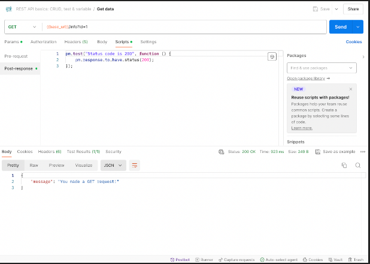

# REST API basics: CRUD, test & variable
🚀 Get started here
This template guides you through CRUD operations (GET, POST, PUT, DELETE), variables, and tests.
🔖 How to use this template
Step 1: Send requests
RESTful APIs allow you to perform CRUD operations using the POST, GET, PUT, and DELETE HTTP methods.
This collection contains each of these request types. Open each request and click "Send" to see what happens.
Step 2: View responses
Observe the response tab for status code (200 OK), response time, and size.
Step 3: Send new Body data
Update or add new data in "Body" in the POST request. Typically, Body data is also used in PUT request.

Plain Text

{
"name": "Add your name in the body"
}

Step 4: Update the variable
Variables enable you to store and reuse values in Postman. We have created a variable called base_url with the sample request https://postman-api-learner.glitch.me. Replace it with your API endpoint to customize this collection.
Step 5: Add tests in the "Scripts" tab
Adding tests to your requests can help you confirm that your API is working as expected. You can write test scripts in JavaScript and view the output in the "Test Results" tab.

💪 Pro tips
Use folders to group related requests and organize the collection.
Add more scripts to verify if the API works as expected and execute workflows.

💡Related templates
API testing basics
API documentation
Authorization methods

